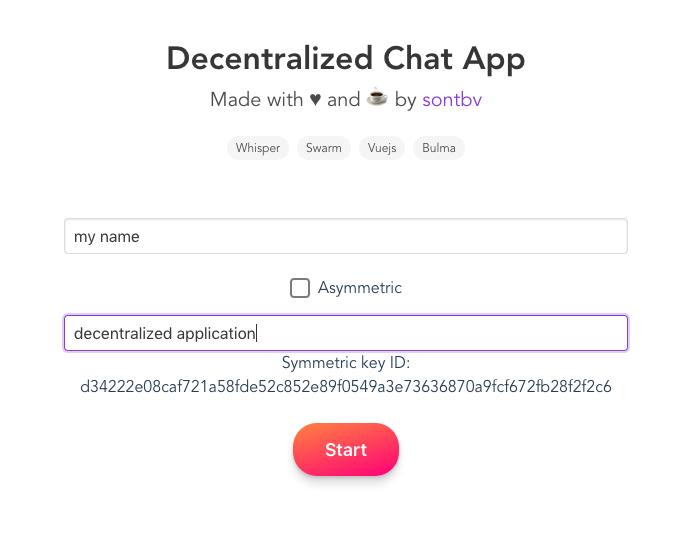
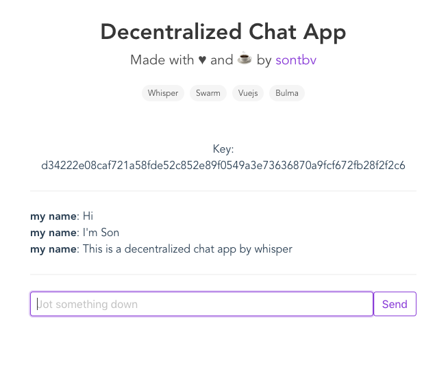

# Eth Decentralized Chat
Inspired by [Siraj Raval](https://www.youtube.com/watch?time_continue=952&v=vVsIHCTGjsE)

### What our application looks like ?

  
  

### Tech stack
- Front end: Vuejs + Bulma
- Whisper for P2P communication
- [WIP] Swarm for decentralized database
- [WIP] Ethereum Name Service (same as DNS)

### To Do
- [ ] Deploy to Swarm
- [ ] Config Ethereum Name Service
- [ ] LocalStorage
